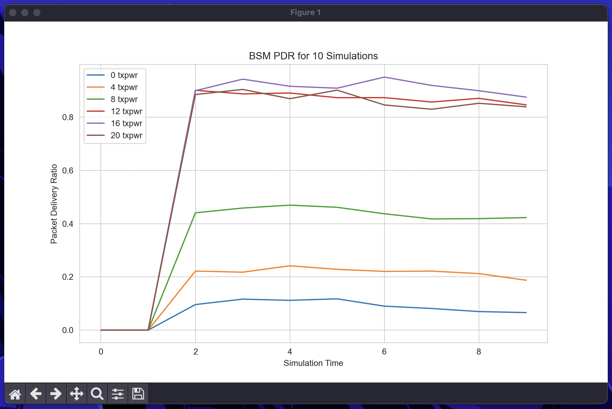

# ns-3 script

## Description
This script runs the vanet-routing-compare example in ns-3 multiple times. Each time, a script parameter is able to be changed.
### Supported parameters
- tx power
- number of cars
## Installation
```bash
cd <ns-3 path>
git clone https://github.com/AineeJames/ns-3_script
cd ns-3_script
python3 -m venv venv
source venv/bin/activate
pip install -r "requirements.txt"
python DSRC_script.py --help   # verify install
```
## Usage
<details>
<summary>Changing the number of cars</summary>
<br>
```bash
python DSRC_script.py -M cars
```
</details>

### Changing the number of cars
```bash
python DSRC_script.py -M cars
```
### Changing the tx power
```bash
python DSRC_script.py -M txpwr
```
### Graph previous data
```bash
python DSRC_script.py -M {cars,txpwr} -P
```
